### Contents

- [SOLID Design Principles](#solid-design-principles)
  - [Introduction to Design Principles](#introduction-to-design-principles)
  - [Single Responsibility Principle (SRP)](#single-responsibility-principle-srp)
  - [Open/Closed Principle (OCP)](#openclosed-principle-ocp)
  - [Liskov's Substitution Principle (LSP)](#liskovs-substitution-principle-lsp)
  - [Interface Segregation Principle (ISP)](#interface-segregation-principle-isp)
  - [Dependency Inversion Principle (DIP)](#dependency-inversion-principle-dip)
- [Introduction to Design Patterns](#introduction-to-design-patterns)
  - [A Simple Scenario](#a-simple-scenario)
  - [What Are Design Patterns?](#what-are-design-patterns)
  - [Evolution of Design Patterns](#evolution-of-design-patterns)
  - [Need for Design Patterns](#need-for-design-patterns)
  - [Classification of Design Patterns](#classification-of-design-patterns)
- [Creational Design Patterns](#creational-design-patterns)
  - [Factory Design Pattern](#factory-design-pattern)
  - [Builder Design Pattern](#builder-design-pattern)
  - [Prototype Design Pattern](#prototype-design-pattern)
  - [Singleton Design Pattern](#singleton-design-pattern)
- [Structural Design Patterns](#structural-design-patterns)
  - [Adapter Design Pattern](#adapter-design-pattern)
  - [Bridge Design Pattern](#bridge-design-pattern)
  - [Composite Design Pattern](#composite-design-pattern)
  - [Facade Design Pattern](#facade-design-pattern)
  - [Proxy Design Pattern](#proxy-design-pattern)
  - [Decorator Design Pattern](#decorator-design-pattern)
- [Behavioral Design Patterns](#behavioral-design-patterns)
  - [Chain of Responsibility Design Pattern](#chain-of-responsibility-design-pattern)
  - [Observer Design Pattern](#observer-design-pattern)

## SOLID Design Principles

Design principles are a **set of guidelines or a toolkit** that help developers write the **best version of their code**.

### Introduction to Design Principles

#### What Are Design Principles?

- Simple **guidelines to follow** to build a **scalable** software system
- Aim to create **testable, readable, and understandable** code
- Help in creating code that is **easy to maintain**
- Enable **multiple developers** to collaborate effectively on the same codebase

### Overview of SOLID

The **SOLID** design principles consist of the following:

- **Single Responsibility Principle (SRP)** – Each class should have **only one responsibility**
- **Open/Closed Principle (OCP)** – A class should be **open for extension** but **closed for modification**
- **Liskov's Substitution Principle (LSP)** – **Subclasses should be replaceable** for their base classes
- **Interface Segregation Principle (ISP)** – Clients **should not be forced to implement functions** they do not use
- **Dependency Inversion Principle (DIP)** – **Depend on abstractions**, not on concrete implementations

Uncle Bob argued that without a good design, an application can become:

- **Rigid**: Everything feels “set in stone”; changing one thing **always breaks something else**, and it’s hard to see what.
- **Fragile**: Changes are easy to make, but you never know **what unrelated parts might break**.
- **Immobile**: Code **cannot be reused** without copying and pasting it into new places.
- **Viscous**: Every change tends to **break everything**, and although you can patch it back together, the next developer will face the same pain.

#### Need for Design Principles in Software Development

- Create a **common goal** for designing **high‑quality code**
- Help **extend the lifetime** of a product and make future changes safer

---

### Single Responsibility Principle (SRP)

> A class should have only one responsibility, i.e., it should be responsible for **only a single functionality** or part of a functionality.

#### Key Idea

- **One class, one responsibility**
- Since a class has only one responsibility, it has **only one reason to change**
- If a class has multiple responsibilities and one behaviour is modified, there is a higher risk of **introducing bugs** in other behaviours

#### Visual Representation

**Before applying SRP:**

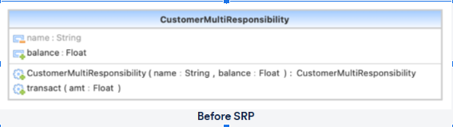

**After applying SRP:**

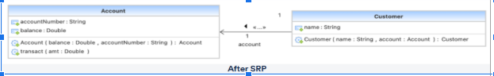

#### Files in This Repo

- **SRP examples**
  - [Account.java](solid/SRP/Account.java)
  - [Customer.java](solid/SRP/Customer.java)
  - [CustomerMultiResponsibility.java](solid/SRP/CustomerMultiResponsibility.java)
  - [SRPDemo.java](solid/SRP/SRPDemo.java)

---

### Open/Closed Principle (OCP)

> A class should be **open for extension but closed for modification**.

#### Key Idea

- Classes should be **open for extension** (you can add new behaviour), but **closed for modification** (you shouldn't need to change existing code).
- New functionality should be added by **extending** existing classes, not by **editing** them.
- Avoid unnecessary modifications to existing, working code to reduce the chances of introducing **new bugs**.

#### Visual Representation

**Before applying OCP:**

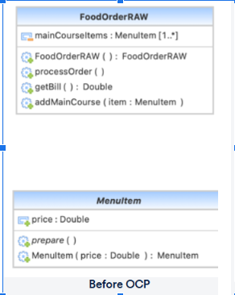

**After applying OCP:**

#### Why Is OCP Important?

- Supports **remote extension** – classes often come from **third‑party libraries**, so you should be able to extend them without touching their source.
- Encourages **loose coupling**
- Reduces the risk of **regressions** because existing, stable code is not modified

#### Files in This Repo

- **BAD**
  - [Demo.java](solid/OCP/BAD/Demo.java)
  - [FoodOrderRAW.java](solid/OCP/BAD/FoodOrderRAW.java)
  - [MainCourse.java](solid/OCP/BAD/MainCourse.java)
  - [MenuItem.java](solid/OCP/BAD/MenuItem.java)

- **Good OCP Code**
  - [Dessert.java](solid/OCP/Good%20OCP%20Code/Dessert.java)
  - [FoodOrder.java](solid/OCP/Good%20OCP%20Code/FoodOrder.java)
  - [MainCourse.java](solid/OCP/Good%20OCP%20Code/MainCourse.java)
  - [MenuItem.java](solid/OCP/Good%20OCP%20Code/MenuItem.java)
  - [OCPDemo.java](solid/OCP/Good%20OCP%20Code/OCPDemo.java)

---

### Liskov's Substitution Principle (LSP)

> Subtypes must be **substitutable** for their base types.

#### Key Idea

- Subclasses should be able to perform **all the functionalities** of the parent class.
- If a class `T` inherits from a class `S`, then `T` should be **usable anywhere** `S` is expected **without breaking** existing behaviour.
- The aim is to enforce **consistency** in polymorphic hierarchies.

#### Visual Representation

**Before applying LSP:**

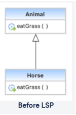

**After applying LSP:**

#### Summary

- LSP states that **subclasses should be substitutable for their base classes**.
- If `A` is a subtype of `B`, then instances of `B` in a program should be replaceable with instances of `A` **without affecting the program’s correctness**.
- Bugs often occur when a child class **cannot safely perform** the same behaviours as its parent class.

#### Files in This Repo

- **BAD**
  - [Animal.java](solid/LSP/BAD/Animal.java)
  - [AnimalDemo.java](solid/LSP/BAD/AnimalDemo.java)
  - [Horse.java](solid/LSP/BAD/Horse.java)
  - [Lion.java](solid/LSP/BAD/Lion.java)

- **Good LSP Codes**
  - [Animal.java](solid/LSP/Good%20LSP%20Codes/Animal.java)
  - [AnimalDemo.java](solid/LSP/Good%20LSP%20Codes/AnimalDemo.java)
  - [Carnivore.java](solid/LSP/Good%20LSP%20Codes/Carnivore.java)
  - [Herbivore.java](solid/LSP/Good%20LSP%20Codes/Herbivore.java)
  - [Horse.java](solid/LSP/Good%20LSP%20Codes/Horse.java)
  - [Lion.java](solid/LSP/Good%20LSP%20Codes/Lion.java)

---

### Interface Segregation Principle (ISP)

> Many **client‑specific interfaces** are better than one **general‑purpose interface**.

#### Key Idea

- Always try to implement **client‑specific interfaces** rather than one large, general‑purpose interface.
- Clients **should not be forced to implement methods they do not need**.
- Actions should be **split into smaller sets** so that a class can depend only on the **operations it actually uses**.

#### Visual Representation

**Before applying ISP:**

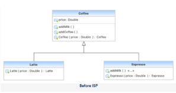

**After applying ISP:**

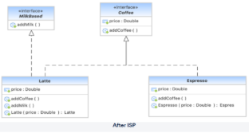

#### Summary

- Interfaces should be decomposed into **small, cohesive groups** of related members.
- When you change a large interface, you must update **every class** that implements it.
- Smaller, focused interfaces mean that changes affect **fewer classes**, reducing the cost of evolution.

#### Files in This Repo

- **BAD**
  - [Coffee.java](solid/ISP/BAD/Coffee.java)
  - [CoffeeDemo.java](solid/ISP/BAD/CoffeeDemo.java)
  - [Espresso.java](solid/ISP/BAD/Espresso.java)
  - [Latte.java](solid/ISP/BAD/Latte.java)

- **GOOD ISP Codes**
  - [Coffee.java](solid/ISP/GOOD%20ISP%20COdes/Coffee.java)
  - [CoffeeDemo.java](solid/ISP/GOOD%20ISP%20COdes/CoffeeDemo.java)
  - [Espresso.java](solid/ISP/GOOD%20ISP%20COdes/Espresso.java)
  - [Latte.java](solid/ISP/GOOD%20ISP%20COdes/Latte.java)
  - [MilkBased.java](solid/ISP/GOOD%20ISP%20COdes/MilkBased.java)

---

### Dependency Inversion Principle (DIP)

> Depend on **abstractions**, not on concretions.

#### Key Idea

- High‑level modules and low‑level modules should both **depend on abstractions (interfaces/abstract classes)**.
- A class should not be tightly fused to a specific tool it uses; instead, it should depend on an **interface** that the tool implements.
- The goal is to **reduce coupling** between classes by introducing **abstraction layers**.

#### Visual Representation

**Before applying DIP:**

**After applying DIP:**

#### Summary

- DIP states: **“Depend upon abstractions. Do not depend upon concretions.”**
- Neither the high‑level class nor the abstraction needs to know **how the concrete tool works internally**.
- The tool must **conform to the abstraction’s contract**, but implementation details remain independent.

#### Files in This Repo

- **BAD**
  - [BotDemo.java](solid/DIP/BAD/BotDemo.java)
  - [TalkingBot.java](solid/DIP/BAD/TalkingBot.java)
  - [WalkingBot.java](solid/DIP/BAD/WalkingBot.java)

- **Good DIP Codes**
  - [Bot.java](solid/DIP/Good%20DIP%20Codes/Bot.java)
  - [BotDemo.java](solid/DIP/Good%20DIP%20Codes/BotDemo.java)
  - [TalkingBot.java](solid/DIP/Good%20DIP%20Codes/TalkingBot.java)
  - [WalkingBot.java](solid/DIP/Good%20DIP%20Codes/WalkingBot.java)

---

## Introduction to Design Patterns

In short, **design patterns are conventional answers to common software design issues**.  
Each pattern is similar to a **blueprint** that you can alter to tackle a specific design problem in your code.

### A Simple Scenario

#### Identifying the Genre of a Book

- **Question**: How will you build a system that can identify the genre of a book?  
  **Answer**: Input the book to the system code and let the code give the genre of the book as output.  
  A naive way is to have simple `if/else` statements that directly return the genre.

- **Question**: What do you think is the problem with the above approach?  
  **Answer**:
  - It creates a **monolithic structure**
  - **Reuse** of parts becomes difficult
  - **Maintenance** of code becomes very complex

#### Better Approach

Have **multiple handlers**, each used for handling only one type of book:

- One handler checks: *Is it a thriller?*  
  - If yes, it returns the genre  
  - If not, it passes the request to the next handler
- The next handler checks for another genre, and so on.

- **Learning**: This approach is basically the **Chain of Responsibility pattern**.

- **Advantages of this pattern**:
  - **Simple structure**
  - **Easily reusable**
  - **Easy to maintain**

### What Are Design Patterns?

- **Generic solution** to a problem that occurs repeatedly in software development
- **Not actual code**
- A design pattern is a **template or description** of how to solve a problem
- Can be thought of as **best practices** to follow while designing to avoid problems

### Evolution of Design Patterns

- **Architecture**:  
  Earliest implementation of patterns was introduced in architecture.  
  Later, the idea of patterns in building things was introduced in code as well.

- **Gang of Four (GoF)**:  
  In 1994, the Gang of Four introduced software design patterns. This group included:
  - Erich Gamma
  - Richard Helm
  - Ralph Johnson
  - John Vlissides

### Need for Design Patterns

- **Avoid repeating the same mistakes** over and over again
- **Build a common terminology** that everyone can understand
- **Save time** by trying to avoid rework after development is completed
- Provide a **solution independent of any specific code or programming language**
- Provide a **verified, proven solution** to solve software issues
- Make the system **easier to understand and maintain**

### Classification of Design Patterns

Design patterns are generally classified into three main categories:

#### Creational Design Patterns

- Define **how classes and objects will be created**
- Different classes of objects can follow different **mechanisms for creating objects**
- **Hide the actual implementation** of classes from their usage
- Useful when the user **does not care about the implementation**, only about the **final created product**

#### Structural Design Patterns

- Define the **relationships between different classes**
- Concerned with **how different classes and subclasses are organised** amongst each other
- Describe **how classes and objects are composed** to form larger objects and structures
- **Difference from creational patterns**:
  - Creational patterns focus on **how objects are created**
  - Structural patterns focus on **how objects are related and composed**

#### Behavioral Design Patterns

- Define **how different classes and objects communicate** with each other
- Concerned with **how responsibilities are shared** amongst different classes
- Help define and **streamline complex flows of information** between different classes

## Creational Design Patterns

Creational patterns focus primarily on **object creation mechanisms**, i.e., they deal with the **flexibility** and **reuse** of code.

### Types of Creational Patterns

- **Factory Design Pattern**
- **Builder Design Pattern**
- **Prototype Design Pattern**
- **Singleton Design Pattern**

### Factory Design Pattern

#### GoF Definition

> Define an interface for creating an object, but let subclasses decide which class to instantiate.  
> The factory method lets a class defer instantiation it uses to subclasses.

#### Intent

- Define an **object creation interface**, but allow subclasses to choose which class to instantiate
- A class can use the **Factory Method** to **delay instantiation** to subclasses
- Define a constructor that is "**virtual**"
- The `new` operator is considered **dangerous** when spread all over the code

#### Advantages

- Subclasses can choose **which object to create**
- Factory pattern promotes **loose coupling**

#### Uses

- Can be used when **which subclass to create is not known** in advance
- When a **subclass should specify** which object is to be created

#### Visual Representation

**Before applying Factory Pattern:**

**After applying Factory Pattern:**

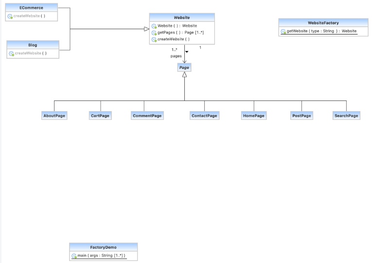

#### Summary

- The Factory design pattern is a **creational design pattern** that provides an **interface for producing objects in a superclass** while allowing **subclasses to choose** the type of objects created
- The Factory pattern implies that you use a **special Factory method** instead of using the `new` operator directly to generate an object
- The `new` operator is still used to generate the objects, but it is now **invoked from within the Factory function**
- A **product** is a term used to describe the objects returned by a Factory method

#### When to Use the Factory Pattern

- When you **do not know the exact kinds and dependencies** of the objects your code should interact with ahead of time
- When you want to **let users extend libraries or frameworks** by plugging in their own components
- When you wish to **save system resources by reusing existing objects** rather than constructing them each time

#### Files in This Repo

- **BAD CODES**
  - [AboutPage.java](creational/Factory%20Design%20Patterns/BAD%20CODES/AboutPage.java)
  - [CartPage.java](creational/Factory%20Design%20Patterns/BAD%20CODES/CartPage.java)
  - [CommentPage.java](creational/Factory%20Design%20Patterns/BAD%20CODES/CommentPage.java)
  - [ContactPage.java](creational/Factory%20Design%20Patterns/BAD%20CODES/ContactPage.java)
  - [FactoryBadDemo.java](creational/Factory%20Design%20Patterns/BAD%20CODES/FactoryBadDemo.java)
  - [HomePage.java](creational/Factory%20Design%20Patterns/BAD%20CODES/HomePage.java)
  - [SearchPage.java](creational/Factory%20Design%20Patterns/BAD%20CODES/SearchPage.java)
  - [Website.java](creational/Factory%20Design%20Patterns/BAD%20CODES/Website.java)

- **GOOD Factory Codes**
  - [AboutPage.java](creational/Factory%20Design%20Patterns/GOOD%20Factory%20Codes/AboutPage.java)
  - [Blog.java](creational/Factory%20Design%20Patterns/GOOD%20Factory%20Codes/Blog.java)
  - [CartPage.java](creational/Factory%20Design%20Patterns/GOOD%20Factory%20Codes/CartPage.java)
  - [CommentPage.java](creational/Factory%20Design%20Patterns/GOOD%20Factory%20Codes/CommentPage.java)
  - [ContactPage.java](creational/Factory%20Design%20Patterns/GOOD%20Factory%20Codes/ContactPage.java)
  - [ECommerce.java](creational/Factory%20Design%20Patterns/GOOD%20Factory%20Codes/ECommerce.java)
  - [FactoryDemo.java](creational/Factory%20Design%20Patterns/GOOD%20Factory%20Codes/FactoryDemo.java)
  - [HomePage.java](creational/Factory%20Design%20Patterns/GOOD%20Factory%20Codes/HomePage.java)
  - [Page.java](creational/Factory%20Design%20Patterns/GOOD%20Factory%20Codes/Page.java)
  - [PostPage.java](creational/Factory%20Design%20Patterns/GOOD%20Factory%20Codes/PostPage.java)
  - [SearchPage.java](creational/Factory%20Design%20Patterns/GOOD%20Factory%20Codes/SearchPage.java)
  - [Website.java](creational/Factory%20Design%20Patterns/GOOD%20Factory%20Codes/Website.java)
  - [WebsiteFactory.java](creational/Factory%20Design%20Patterns/GOOD%20Factory%20Codes/WebsiteFactory.java)

### Builder Design Pattern

#### GoF Definition

> Separate the construction of a complex object from its representation so that the same construction process can create different representations.

#### Intent

- Separate the **creation of a complicated object** from its representation so that the **same building technique** can be used to make several representations
- Create one of numerous targets by **parsing a complicated representation**

#### Advantages

- Differentiates **construction** and **representation** of objects
- Gives **control over the construction process**

#### Uses

- Construct a **complex object** from simple objects using a **step-by-step approach**

#### Visual Representation

**Before applying Builder Pattern:**

**After applying Builder Pattern:**

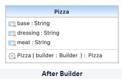

#### Summary

- Builder is a design pattern that allows you to **build complicated objects in stages**
- Using the **same building code**, you can create **different types and representations** of the same object
- The Builder pattern recommends **separating the object creation code from its own class** and moving it to distinct objects known as **Builders**

#### When to Use the Builder Pattern

- To get rid of a **"telescopic constructor"**, use the Builder pattern
- When you want your code to be able to **produce several representations of a product**
- Build **composite trees and other complicated objects** using the Builder
- During the construction process, a Builder **does not expose the unfinished result**, which prevents client code from retrieving a partial result

#### Files in This Repo

- **BAD**
  - [Pizza.java](creational/Builder%20Design%20Pattern/BAD/Pizza.java)
  - [PizzaDemo.java](creational/Builder%20Design%20Pattern/BAD/PizzaDemo.java)
  - [PizzaTelescoping.java](creational/Builder%20Design%20Pattern/BAD/PizzaTelescoping.java)

- **GOOD Builder Pattern**
  - [BuilderDemo.java](creational/Builder%20Design%20Pattern/GOOD%20Builder%20Pattern/BuilderDemo.java)
  - [Pizza.java](creational/Builder%20Design%20Pattern/GOOD%20Builder%20Pattern/Pizza.java)

### Prototype Design Pattern

#### GoF Definition

> Specify the kinds of objects to create using a prototypical instance, and create new objects by copying this prototype.

#### Intent

- Using a **prototypical instance**, specify the kinds of objects to generate  
- Duplicate this prototype to **generate new objects**

#### Advantages

- Need for **subclassing is reduced**
- Complexities of the class are **hidden**
- Users get new objects **without knowing the exact type** of objects created
- You can **add or remove objects at runtime**

#### Uses

- When classes have to be **instantiated at runtime**
- When it is **expensive and complex to create an object**
- When the client **should not be aware** of how the object is created and represented

#### Visual Representation

**Before applying Prototype Pattern:**

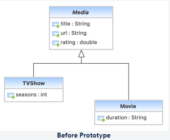

**After applying Prototype Pattern:**

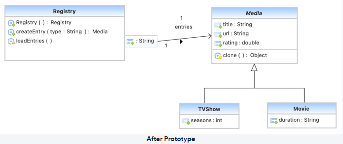

#### Summary

- Prototype is a design pattern that allows you to **clone existing objects** without having to rely on their classes in your code
- Because some of the object's fields may be **private and not viewable** from outside, not all objects can be cloned trivially
- The cloning operation is **delegated to objects** using the Prototype pattern
- The pattern declares a **standard interface for all cloning-capable objects**
- This interface allows you to clone an object **without tying your code to the object's class**; typically it exposes a single `clone` method

#### When to Use the Prototype Pattern

- When your code **should not depend on concrete classes** of objects you are copying
- When you need to **limit the number of subclasses** that differ only in how they initialize their objects  
  Instead of creating a subclass for every configuration, the client can **find and clone an appropriate Prototype**

#### Files in This Repo

- **BAD**
  - [Media.java](creational/Prototype%20Design%20Pattern/BAD/Media.java)
  - [Movie.java](creational/Prototype%20Design%20Pattern/BAD/Movie.java)
  - [PrototypeDemo.java](creational/Prototype%20Design%20Pattern/BAD/PrototypeDemo.java)
  - [TVShow.java](creational/Prototype%20Design%20Pattern/BAD/TVShow.java)

- **Good Prototype Pattern**
  - [Media.java](creational/Prototype%20Design%20Pattern/Good%20Prototype%20Pattern/Media.java)
  - [Movie.java](creational/Prototype%20Design%20Pattern/Good%20Prototype%20Pattern/Movie.java)
  - [PrototypeDemo.java](creational/Prototype%20Design%20Pattern/Good%20Prototype%20Pattern/PrototypeDemo.java)
  - [Registry.java](creational/Prototype%20Design%20Pattern/Good%20Prototype%20Pattern/Registry.java)
  - [TVShow.java](creational/Prototype%20Design%20Pattern/Good%20Prototype%20Pattern/TVShow.java)

### Singleton Design Pattern

#### GoF Definition

> Ensure a class only has one instance and provide a global point of access to it.

#### Intent

Only if **all three** of the following criteria are met should Singleton be considered:

- It is **impossible to give reasonable ownership** to a single instance.
- It’s preferable to use a **lazy initialization** method.
- Otherwise, there is **no provision for global access**.

More generally, the intent is to:

- Make sure a class **only has one instance**.
- Provide that instance with a **global access point**.
- Encapsulate **just‑in‑time initialization** (initialization on first usage).

#### Advantages

- **Memory and cost are saved** because the object is not created repeatedly for each request.
- A **single instance is reused**, avoiding duplicate expensive setup.

#### Uses

- Commonly used in **database applications** or **multi‑threaded applications**.
- Examples: **thread pools**, **caching**, **logging**, configuration managers, etc.

#### Visual Representation

**After applying Singleton Pattern:**

#### Summary

- The Singleton design pattern ensures that a class has **only one instance** while also giving a **global access point** to that instance.
- To prevent other objects from using the `new` operator with the Singleton class, **make the default constructor private**.
- A real‑world analogy is a **government**: there is only one official government in a country, and the name “The Government of X” acts as a **global access point**, regardless of the individuals in office.

#### When to Use the Singleton Pattern

- When a class in your software should have **exactly one instance** available to all clients  
  (for example, a single database object shared by all components).
- When you require **tighter control over global variables**, and want their lifecycle and access centralized.

> Note: one of the challenges of Singleton is that it can **violate the Single Responsibility Principle (SRP)**,  
> because the class is now responsible for both its **primary behavior** and **managing its sole instance**.

#### Files in This Repo

- **Singleton Design Pattern**
  - [Database.java](creational/Single%20Design%20Pattern/Database.java)
  - [DatabaseSingletonDemo.java](creational/Single%20Design%20Pattern/DatabaseSingletonDemo.java)

## Structural Design Patterns

Structural design patterns focus on the **organisation of classes and objects into larger units**.

### Types of Structural Patterns

- **Adapter Design Pattern**
- **Bridge Design Pattern**
- **Composite Design Pattern**
- **Proxy Design Pattern**
- **Facade Design Pattern**
- **Decorator Design Pattern**

### Adapter Design Pattern

#### GoF Definition

> Convert the interface of a class into another interface clients expect.  
> Adapter lets classes work together that couldn’t otherwise because of incompatible interfaces.

#### Intent

- Convert a class’s **interface** to the interface that **clients expect**.
- Allow classes that couldn’t operate together earlier due to **mismatched interfaces** to now work together with the help of an adapter.
- Wrap an **existing class** with a **new interface**.
- “Match the resistance” of an old component to a **new system**.

#### Advantages

- **Incompatible classes can communicate** with each other.
- **Existing functionality can be reused** without modifying existing classes.

#### Uses

- When an **incompatible interface must be used**.
- When **reusable classes** must be created that work with classes having incompatible interfaces.

#### Visual Representation

**Before applying Adapter Pattern:**

**After applying Adapter Pattern:**

#### Summary

- The Adapter design pattern is a **structural design pattern** that allows **objects with mismatched interfaces to work together**.
- An Adapter is a **special object** that changes an object's interface so it can be understood by another object.
- Adapters can both **mediate communication** between objects with different interfaces and **translate data** into different representations.

#### When to Use the Adapter Pattern

- When you wish to **use an existing class** but its interface is **not consistent** with the rest of your code.
- When you want to **reuse many existing subclasses** that lack some common functionality that cannot be added to the superclass.
- Clients should depend only on the **client-facing interface** and use the Adapter through that,  
  so you can **change or extend Adapters** without touching client code.

#### Files in This Repo

- **BAD**
  - [AdapterDemo.java](structural/Adapter%20Design%20Pattern/bad/AdapterDemo.java)
  - [CreditCard.java](structural/Adapter%20Design%20Pattern/bad/CreditCard.java)
  - [CreditCardClient.java](structural/Adapter%20Design%20Pattern/bad/CreditCardClient.java)
  - [CreditCardDB.java](structural/Adapter%20Design%20Pattern/bad/CreditCardDB.java)
  - [CreditCardLegacy.java](structural/Adapter%20Design%20Pattern/bad/CreditCardLegacy.java)

- **GOOD**
  - [AdapterDemo.java](structural/Adapter%20Design%20Pattern/good/AdapterDemo.java)
  - [CreditCard.java](structural/Adapter%20Design%20Pattern/good/CreditCard.java)
  - [CreditCardClient.java](structural/Adapter%20Design%20Pattern/good/CreditCardClient.java)
  - [CreditCardDB.java](structural/Adapter%20Design%20Pattern/good/CreditCardDB.java)
  - [CreditCardLegacy.java](structural/Adapter%20Design%20Pattern/good/CreditCardLegacy.java)
  - [LegacyCreditCardAdapter.java](structural/Adapter%20Design%20Pattern/good/LegacyCreditCardAdapter.java)

### Bridge Design Pattern

#### GoF Definition

> Decouple an abstraction from its implementation so that the two can vary independently.

#### Intent

- Separate an **abstraction** from its **implementation** so that they can be **changed independently**.
- Keep the implementation buried in its own **inheritance hierarchy**, while exposing the abstraction/interface in a **separate hierarchy**.
- Provide an extra level of **insulation** between abstraction and implementation (a step beyond simple encapsulation).

#### Advantages

- The **implementation is separated** from the class interface.
- Adds **extensibility** – you can introduce new abstractions and implementations independently.
- Clients **do not need to know** how the class is implemented.

#### Uses

- When the **client should not be affected** by changes made in the implementation of a class.
!- When **implementation and abstraction** both need to be **extended independently**.

#### Visual Representation

**Before applying Bridge Pattern:**

**After applying Bridge Pattern:**

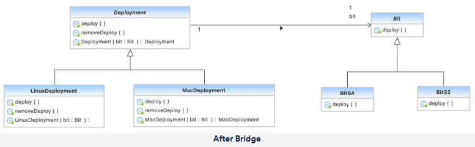

#### Summary

- Bridge is a **structural design pattern** that lets you split a large class or a group of closely related classes into **two separate hierarchies**:  
  one for **abstractions** and another for **implementations**, which can be developed independently.
- The abstraction acts as a **high‑level control layer**; it doesn’t do the work itself, but delegates to the implementation layer (also called the **platform**).
- In a monolithic codebase, even a small change can be risky because it requires understanding the entire system.  
  With Bridge, it’s easier to change smaller, **well‑defined modules** without impacting others.

#### When to Use the Bridge Pattern

- When you want to **separate and organise a monolithic class** that has many variants of some functionality  
  (for example, when a class can work with various database servers, operating systems, or devices).
- When you need to **extend a class in several orthogonal (independent) dimensions** – e.g., different platforms × different features.
- When you might need to **swap implementations at runtime or mid‑project** without changing the client‑side abstraction.

#### Files in This Repo

- **BAD**
  - [Bit.java](structural/Bridge%20Design%20Pattern/bad/Bit.java)
  - [Bit32.java](structural/Bridge%20Design%20Pattern/bad/Bit32.java)
  - [Bit64.java](structural/Bridge%20Design%20Pattern/bad/Bit64.java)
  - [Deployment.java](structural/Bridge%20Design%20Pattern/bad/Deployment.java)
  - [LinuxBit32.java](structural/Bridge%20Design%20Pattern/bad/LinuxBit32.java)
  - [LinuxBit64.java](structural/Bridge%20Design%20Pattern/bad/LinuxBit64.java)
  - [LinuxDeployment.java](structural/Bridge%20Design%20Pattern/bad/LinuxDeployment.java)
  - [MacDeployment.java](structural/Bridge%20Design%20Pattern/bad/MacDeployment.java)

- **GOOD**
  - [Bit.java](structural/Bridge%20Design%20Pattern/good/Bit.java)
  - [Bit32.java](structural/Bridge%20Design%20Pattern/good/Bit32.java)
  - [Bit64.java](structural/Bridge%20Design%20Pattern/good/Bit64.java)
  - [BridgeDemo.java](structural/Bridge%20Design%20Pattern/good/BridgeDemo.java)
  - [Deployment.java](structural/Bridge%20Design%20Pattern/good/Deployment.java)
  - [LinuxDeployment.java](structural/Bridge%20Design%20Pattern/good/LinuxDeployment.java)
  - [MacDeployment.java](structural/Bridge%20Design%20Pattern/good/MacDeployment.java)

### Composite Design Pattern

#### GoF Definition

> Compose objects into tree structures to represent part‑whole hierarchies.  
> Composite lets clients treat individual objects and compositions of objects uniformly.

#### Intent

- Compose objects into **tree structures** to depict **whole‑part hierarchies**.
- Allow clients to **treat individual objects and combinations of objects uniformly**.
- Support **recursive composition** – for example, “each of the entries in a directory might be a directory.”
- Prefer a “**has‑a**” relationship over “is‑a” when modelling 1‑to‑many object compositions.

#### Advantages

- Clearly defines a **hierarchy of classes/objects**.
>- New objects (leaves or composites) can be **added easily**.
- The overall structure becomes **flexible and easy to manage** via common interfaces.

#### Uses

- When a **class hierarchy or part‑whole structure** needs to be modelled.
- When **additional responsibilities** should be added at runtime without disturbing existing functionality.

#### Visual Representation

**After applying Composite Pattern:**

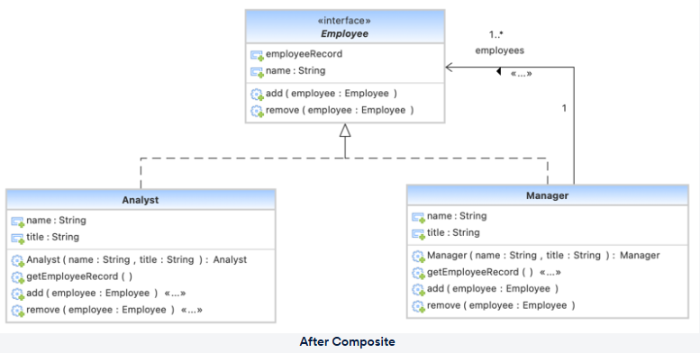

#### Summary

- Composite is a **structural design pattern** that lets you group elements into **tree structures** and work with them as if they were **individual objects**.
- Client code **doesn’t need to know** whether it is operating on a simple leaf or an entire composite;  
  using a shared interface, it can **treat them all the same**.
- When a method is called on a composite, the request is **delegated down the tree** by the objects themselves.

#### When to Use the Composite Pattern

- When you need to create a **tree‑like object structure** (for example, file systems, menus, UI components, or organization charts).
- When you want client code to **treat both simple and complex objects uniformly**, using the same operations.

#### Files in This Repo

- **Company directory example**
  - [Analyst.java](structural/Composite%20Design%20Pattern/companydirectory/Analyst.java)
  - [CompositeDemo.java](structural/Composite%20Design%20Pattern/companydirectory/CompositeDemo.java)
  - [Employee.java](structural/Composite%20Design%20Pattern/companydirectory/Employee.java)
  - [Manager.java](structural/Composite%20Design%20Pattern/companydirectory/Manager.java)

- **Tree example**
  - [CompositeDemo.java](structural/Composite%20Design%20Pattern/tree/CompositeDemo.java)
  - [Tree.java](structural/Composite%20Design%20Pattern/tree/Tree.java)
  - [TreeComponent.java](structural/Composite%20Design%20Pattern/tree/TreeComponent.java)
  - [TreeNode.java](structural/Composite%20Design%20Pattern/tree/TreeNode.java)

### Facade Design Pattern

#### GoF Definition

> Provide a unified interface to a set of interfaces in a subsystem.  
> Facade defines a higher‑level interface that makes the subsystem easier to use.

#### Intent

- Provide a **uniform interface** to a group of subsystem interfaces.
- Introduce a **higher‑level interface** (the Facade) that makes a complex subsystem **easier to use**.
- Wrap a **complex subsystem** behind a more **user‑friendly interface**.

#### Advantages

- **Hides the complexities** of subsystem components from clients.
- Enhances **loose coupling** between clients and inner components.

#### Uses

- When you want to expose a **simple interface** for a **complex system**.

#### Visual Representation

**Before applying Facade Pattern:**

**After applying Facade Pattern:**

#### Summary

- Facade is a **structural design pattern** that **simplifies the interface** to a library, framework, or any other complex set of classes.
- A Facade is a **single class** that provides a straightforward interface to a complicated subsystem with many moving parts.  
  It may offer **limited capabilities** compared to using the subsystem directly, but it focuses on the features that clients **actually need**.

#### When to Use the Facade Pattern

- When you require a **simple but limited interface** to a complicated subsystem.
- When you want to **divide a subsystem into layers** and provide **entry points** to each level via different facades.
- By requiring various subsystems to **communicate only through Facades**, you can **reduce entanglement** and improve modularity.

#### Files in This Repo

- **BAD**
  - [WithoutFacadeDemo.java](structural/Facade%20Design%20Pattern/bad/WithoutFacadeDemo.java)

- **GOOD**
  - [DatabaseServiceFacade.java](structural/Facade%20Design%20Pattern/good/DatabaseServiceFacade.java)
  - [FacadeDemo.java](structural/Facade%20Design%20Pattern/good/FacadeDemo.java)

### Proxy Design Pattern

#### GoF Definition

> Provide a surrogate or placeholder for another object to control access to it.

#### Intent

- Create a **surrogate or placeholder** for another object in order to **control access** to it.
- Add an extra layer of **indirection** to support **distributed, regulated, or intelligent access**.
- Use **wrapper + delegation** to shield the real component from unnecessary complexity.

#### Advantages

- The **original object is protected** and insulated from direct access by external clients.

#### Uses

- Typical examples:
  - Checking if an object is **locked** or not without accessing it directly.
  - Providing a local interface that **accesses remote resources** (remote proxy).
  - Acting as an **access‑control proxy** (for example, blocking Internet access in an office or to certain websites).

#### Visual Representation

**Before applying Proxy Pattern:**

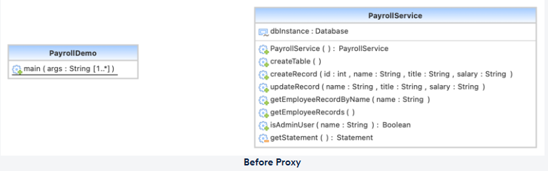

**After applying Proxy Pattern:**

#### Summary

- Proxy is a **structural design pattern** that allows you to use another object as a **substitute or placeholder**.
- A Proxy **manages access** to the real object, allowing you to perform work **before or after** the request reaches the real object.
- When you need to run extra logic around a class’s primary behavior (logging, caching, access control, lazy init), Proxy lets you do this **without modifying the original class**, as it implements the **same interface**.

#### When to Use the Proxy Pattern

- **Virtual Proxy** – when you have a **heavyweight service object** that should be **lazily initialized** because it’s expensive and used only occasionally.
- **Remote Proxy** – when the service object lives on a **remote server**, and you need a local representative to communicate with it.
- **Logging Proxy** – when you want to **log or audit requests** before they reach the service object.
- **Caching Proxy** – when you need to **cache results** of expensive operations and manage the cache’s lifecycle, especially when data is large or expensive to compute.

#### Files in This Repo

- **BAD**
  - [PayrollDemo.java](structural/Proxy%20Design%20Pattern/bad/PayrollDemo.java)
  - [PayrollService.java](structural/Proxy%20Design%20Pattern/bad/PayrollService.java)

- **GOOD**
  - [ProxyDemo.java](structural/Proxy%20Design%20Pattern/good/ProxyDemo.java)
  - [PayrollService.java](structural/Proxy%20Design%20Pattern/good/PayrollService.java)
  - [ProxyPayrollService.java](structural/Proxy%20Design%20Pattern/good/ProxyPayrollService.java)

### Decorator Design Pattern

#### GoF Definition

> Attach additional responsibilities to an object dynamically.  
> Decorators provide a flexible alternative to subclassing for extending functionality.

#### Intent

- Dynamically assign **additional responsibilities** to an object at runtime.
- Provide a **flexible alternative to subclassing** for extending functionality.
- Recursively **wrap a core object** to add client‑specified adornments, much like wrapping a present, placing it in a box, and then wrapping the box.

#### Advantages

- Often **better than static inheritance** for adding features.
- Provides **flexibility** and improves **extensibility**.
- Simplifies adding **new, optional functionalities** without modifying existing classes.

#### Uses

- When functionalities need to be **added transparently and dynamically** to objects.
- When **sub‑classing is not practical** or would lead to an explosion of subclasses.

#### Visual Representation

**Before applying Decorator Pattern:**

**After applying Decorator Pattern:**

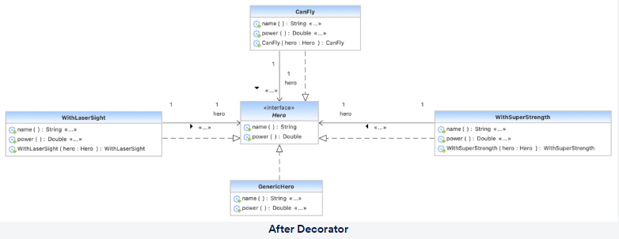

#### Summary

- Decorator is a **structural design pattern** that lets you **attach additional behaviours** to objects by enclosing them in **wrapper objects** that contain those behaviours.
- The pattern is also known as **"Wrapper"**, because the wrapper implements the **same interface** as the wrapped object and **delegates all requests** to it, optionally adding extra work.
- Since decorators follow the same interface, you can **wrap an object in multiple decorators** and the object will gain the **combined behaviour** of all wrappers.

#### When to Use the Decorator Pattern

- When you need to **add extra behaviours to objects at runtime** without disturbing the code that uses them.
- When it's **inconvenient or impossible to extend behaviour using inheritance** (for example, when classes are closed for modification or when many combinations of behaviour are needed).

#### Files in This Repo

- **BAD**
  - [Fly.java](structural/Decorator%20Design%20Pattern/bad/Fly.java)
  - [GenericHero.java](structural/Decorator%20Design%20Pattern/bad/GenericHero.java)
  - [Hero.java](structural/Decorator%20Design%20Pattern/bad/Hero.java)
  - [HeroDemo.java](structural/Decorator%20Design%20Pattern/bad/HeroDemo.java)
  - [SuperPower.java](structural/Decorator%20Design%20Pattern/bad/SuperPower.java)

- **GOOD**
  - [CanFly.java](structural/Decorator%20Design%20Pattern/good/CanFly.java)
  - [GenericHero.java](structural/Decorator%20Design%20Pattern/good/GenericHero.java)
  - [Hero.java](structural/Decorator%20Design%20Pattern/good/Hero.java)
  - [HeroDemo.java](structural/Decorator%20Design%20Pattern/good/HeroDemo.java)
  - [WithLaserSight.java](structural/Decorator%20Design%20Pattern/good/WithLaserSight.java)
  - [WithSuperStrength.java](structural/Decorator%20Design%20Pattern/good/WithSuperStrength.java)

## Behavioral Design Patterns

Behavioral design patterns focus on **object communication mechanisms** – how objects interact, share responsibilities, and pass data or requests among each other.

### Types of Behavioral Patterns

- **Chain of Responsibility Design Pattern**
- **Mediator Design Pattern**
- **Observer Design Pattern**

### Chain of Responsibility Design Pattern

#### GoF Definition

> Avoid coupling the sender of a request to its receiver by giving more than one object a chance to handle the request.  
> Chain the receiving objects and pass the request along the chain until an object handles it.

#### Intent

- Allow more than one object to have a chance to **handle a request**, helping to avoid tight coupling between the request’s **sender and receiver**.
- **Chain the receiving objects** together and pass the request down the chain until one of them handles it.
- Model a **single processing pipeline** with many possible handlers that can start and stop processing a request.
- Can be viewed as **recursive traversal of an object‑oriented linked list** of handlers.

#### Advantages

- Enhances **loose coupling** between senders and receivers.
- Makes assigning and reassigning **responsibilities to objects** much more flexible.

#### Uses

- When **two or more objects can handle a request**.
- When the set of handler objects and their order need to be **specified or changed dynamically**.

#### Visual Representation

**Before applying Chain of Responsibility Pattern:**

**After applying Chain of Responsibility Pattern:**

#### Summary

- Chain of Responsibility allows you to **send requests through a chain of handlers**.  
  Each handler decides whether to **process the request** or **pass it along to the next handler**.
- Like many behavioral patterns, it extracts specific checks or steps into stand‑alone objects called **handlers**.
- Each check is moved to its own class with a single method that **performs the check**, taking the request and its data as arguments.
- A handler can **stop forwarding the request** further down the chain, effectively terminating processing.

#### When to Use the Chain of Responsibility Pattern

- When your software is expected to **process multiple types of requests in various ways**, but the specific types and order of handling **aren’t known in advance**.
- When **multiple handlers** need to be executed in a particular sequence.
- When the **set of handlers and their order** are expected to **change at runtime**.

#### Files in This Repo

- **BAD**
  - [ErrorLogger.java](behavioral/Chain%20of%20Responsibility%20Design%20Pattern/bad/ErrorLogger.java)
  - [InfoLogger.java](behavioral/Chain%20of%20Responsibility%20Design%20Pattern/bad/InfoLogger.java)
  - [Levels.java](behavioral/Chain%20of%20Responsibility%20Design%20Pattern/bad/Levels.java)
  - [Logger.java](behavioral/Chain%20of%20Responsibility%20Design%20Pattern/bad/Logger.java)
  - [LoggerDemo.java](behavioral/Chain%20of%20Responsibility%20Design%20Pattern/bad/LoggerDemo.java)
  - [LoggingService.java](behavioral/Chain%20of%20Responsibility%20Design%20Pattern/bad/LoggingService.java)
  - [WarningLogger.java](behavioral/Chain%20of%20Responsibility%20Design%20Pattern/bad/WarningLogger.java)

- **GOOD**
  - [ChainDemo.java](behavioral/Chain%20of%20Responsibility%20Design%20Pattern/good/ChainDemo.java)
  - [ErrorLogger.java](behavioral/Chain%20of%20Responsibility%20Design%20Pattern/good/ErrorLogger.java)
  - [InfoLogger.java](behavioral/Chain%20of%20Responsibility%20Design%20Pattern/good/InfoLogger.java)
  - [Logger.java](behavioral/Chain%20of%20Responsibility%20Design%20Pattern/good/Logger.java)
  - [LoggingService.java](behavioral/Chain%20of%20Responsibility%20Design%20Pattern/good/LoggingService.java)
  - [WarningLogger.java](behavioral/Chain%20of%20Responsibility%20Design%20Pattern/good/WarningLogger.java)

### Observer Design Pattern

#### GoF Definition

> Define a one‑to‑many dependency between objects so that when one object changes state,  
> all its dependents are notified and updated automatically.

#### Intent

- Create a **one‑to‑many relationship** between objects so that when **one object changes state**,  
  all of its **dependents are automatically notified and updated**.
- Encapsulate the **core / engine logic** in a **Subject** abstraction, and encapsulate the **variable / optional / UI parts** in an **Observer** hierarchy.

#### Advantages

- Enables **broadcast‑style communication** from a single subject to many observers.
- Decouples **publishers (subjects)** from **subscribers (observers)** so they can vary independently.

#### Uses

- When a **state change in one object** should be reflected in the state of **other objects**  
  without creating **tight coupling** between them.

#### Visual Representation

**Before applying Observer Pattern:**

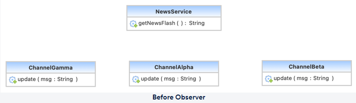

**After applying Observer Pattern:**

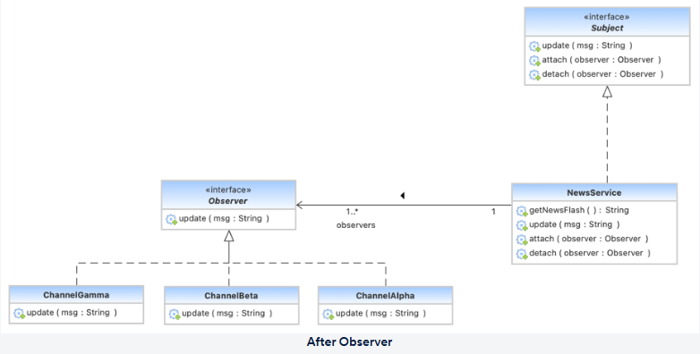

#### Summary

- Observer is a **behavioral design pattern** that introduces a **subscription mechanism** so that multiple objects can be **notified about events** occurring in the object they observe.
- The object that notifies others about its state changes is called the **publisher/subject**,  
  while all objects that track its state are called **subscribers/observers**.
- The publisher exposes methods to **subscribe and unsubscribe** observers from its event stream.

#### When to Use the Observer Pattern

- When changing the state of one object should result in changes in **other objects**, but the exact set of dependents is **unknown in advance or changes dynamically**.
- When some objects must **monitor others only for a limited time or under certain conditions**.

#### Files in This Repo

- **BAD**
  - [ChannelAlpha.java](behavioral/Observer%20Design%20Pattern/bad/ChannelAlpha.java)
  - [ChannelBeta.java](behavioral/Observer%20Design%20Pattern/bad/ChannelBeta.java)
  - [ChannelGamma.java](behavioral/Observer%20Design%20Pattern/bad/ChannelGamma.java)
  - [Demo.java](behavioral/Observer%20Design%20Pattern/bad/Demo.java)
  - [NewsService.java](behavioral/Observer%20Design%20Pattern/bad/NewsService.java)

- **GOOD**
  - [ChannelAlpha.java](behavioral/Observer%20Design%20Pattern/good/ChannelAlpha.java)
  - [ChannelBeta.java](behavioral/Observer%20Design%20Pattern/good/ChannelBeta.java)
  - [ChannelGamma.java](behavioral/Observer%20Design%20Pattern/good/ChannelGamma.java)
  - [Demo.java](behavioral/Observer%20Design%20Pattern/good/Demo.java)
  - [NewsService.java](behavioral/Observer%20Design%20Pattern/good/NewsService.java)
  - [Observer.java](behavioral/Observer%20Design%20Pattern/good/Observer.java)
  - [Subject.java](behavioral/Observer%20Design%20Pattern/good/Subject.java)

### Mediator Design Pattern

#### GoF Definition

> Define an object that encapsulates how a set of objects interact.  
> Mediator promotes loose coupling by keeping objects from referring to each other explicitly,  
> and lets you vary their interaction independently.

#### Intent

- Define an object (the **Mediator**) that **encapsulates the interaction** of a group of collaborating objects.
- Promote **loose coupling** by preventing objects from explicitly referencing one another,  
  and allow their **interaction logic** to vary independently.
- Introduce an **intermediate component** to decouple a large number of peers.
- Increase the **“full object status”** of many‑to‑many relationships by centralising coordination in the mediator.

#### Advantages

- Classes become **decoupled** from one another.
- Interaction **control is centralized** inside the mediator.
- Communication between objects becomes more **generic and maintainable**.
- Handling and evolving individual components becomes **easier**.

#### Uses

- Common in **chat‑like applications** or **message‑based systems**.
- When a group of objects must communicate in a **well‑defined but complex way**.

#### Visual Representation

**Before applying Mediator Pattern:**

**After applying Mediator Pattern:**

#### Summary

- Mediator is a **behavioral design pattern** that reduces the **chaos of object relationships**.  
  Components stop talking to each other directly and collaborate only through a **Mediator object**.
- According to the pattern, components that should be independent of one another must work together via a dedicated mediator,  
  which **routes calls to the appropriate components**. Instead of depending on many peers, components depend only on **one mediator**.
- A good analogy is **air‑traffic control**: aircraft don’t negotiate with each other directly;  
  all coordination goes through the **control tower (mediator)**.

#### When to Use the Mediator Pattern

- When it’s hard to change some classes because they’re **tightly coupled** to many others.
- When a component **cannot easily be reused** in another program because it depends too much on surrounding components.
- When you find yourself creating **many subclasses of components** to reuse behaviour in different interaction scenarios.

#### Files in This Repo

- **BAD**
  - [Car.java](behavioral/Mediator%20Design%20Pattern/bad/Car.java)
  - [Demo.java](behavioral/Mediator%20Design%20Pattern/bad/Demo.java)
  - [Parking.java](behavioral/Mediator%20Design%20Pattern/bad/Parking.java)
  - [ParkingLot.java](behavioral/Mediator%20Design%20Pattern/bad/ParkingLot.java)

- **GOOD**
  - [ChatRoomMediator.java](behavioral/Mediator%20Design%20Pattern/good/ChatRoomMediator.java)
  - [ChatRoomMediatorImpl.java](behavioral/Mediator%20Design%20Pattern/good/ChatRoomMediatorImpl.java)
  - [ChatUser.java](behavioral/Mediator%20Design%20Pattern/good/ChatUser.java)
  - [Demo.java](behavioral/Mediator%20Design%20Pattern/good/Demo.java)
  - [User.java](behavioral/Mediator%20Design%20Pattern/good/User.java)
