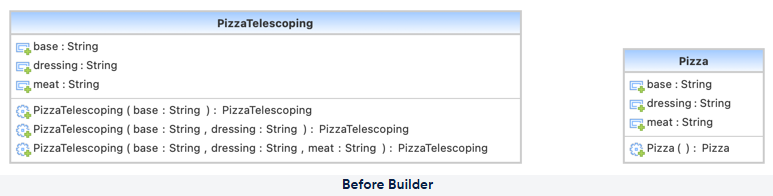
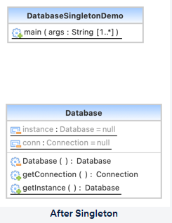
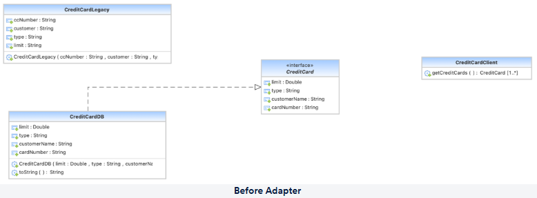
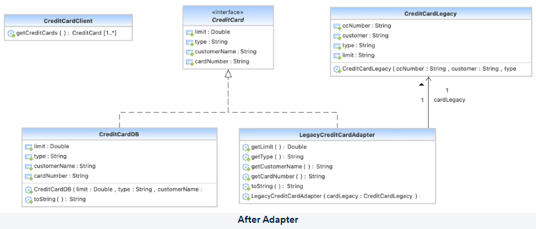

### Contents

- [Introduction to Design Patterns](#introduction-to-design-patterns)
  - [A Simple Scenario](#a-simple-scenario)
  - [What Are Design Patterns?](#what-are-design-patterns)
  - [Evolution of Design Patterns](#evolution-of-design-patterns)
  - [Need for Design Patterns](#need-for-design-patterns)
  - [Classification of Design Patterns](#classification-of-design-patterns)
- [Creational Design Patterns](#creational-design-patterns)
  - [Factory Design Pattern](#factory-design-pattern)
  - [Builder Design Pattern](#builder-design-pattern)
  - [Prototype Design Pattern](#prototype-design-pattern)
  - [Singleton Design Pattern](#singleton-design-pattern)
- [Structural Design Patterns](#structural-design-patterns)
  - [Adapter Design Pattern](#adapter-design-pattern)
  - [Bridge Design Pattern](#bridge-design-pattern)

## Introduction to Design Patterns

In short, **design patterns are conventional answers to common software design issues**.  
Each pattern is similar to a **blueprint** that you can alter to tackle a specific design problem in your code.

### A Simple Scenario

#### Identifying the Genre of a Book

- **Question**: How will you build a system that can identify the genre of a book?  
  **Answer**: Input the book to the system code and let the code give the genre of the book as output.  
  A naive way is to have simple `if/else` statements that directly return the genre.

- **Question**: What do you think is the problem with the above approach?  
  **Answer**:
  - It creates a **monolithic structure**
  - **Reuse** of parts becomes difficult
  - **Maintenance** of code becomes very complex

#### Better Approach

Have **multiple handlers**, each used for handling only one type of book:

- One handler checks: *Is it a thriller?*  
  - If yes, it returns the genre  
  - If not, it passes the request to the next handler
- The next handler checks for another genre, and so on.

- **Learning**: This approach is basically the **Chain of Responsibility pattern**.

- **Advantages of this pattern**:
  - **Simple structure**
  - **Easily reusable**
  - **Easy to maintain**

### What Are Design Patterns?

- **Generic solution** to a problem that occurs repeatedly in software development
- **Not actual code**
- A design pattern is a **template or description** of how to solve a problem
- Can be thought of as **best practices** to follow while designing to avoid problems

### Evolution of Design Patterns

- **Architecture**:  
  Earliest implementation of patterns was introduced in architecture.  
  Later, the idea of patterns in building things was introduced in code as well.

- **Gang of Four (GoF)**:  
  In 1994, the Gang of Four introduced software design patterns. This group included:
  - Erich Gamma
  - Richard Helm
  - Ralph Johnson
  - John Vlissides

### Need for Design Patterns

- **Avoid repeating the same mistakes** over and over again
- **Build a common terminology** that everyone can understand
- **Save time** by trying to avoid rework after development is completed
- Provide a **solution independent of any specific code or programming language**
- Provide a **verified, proven solution** to solve software issues
- Make the system **easier to understand and maintain**

### Classification of Design Patterns

Design patterns are generally classified into three main categories:

#### Creational Design Patterns

- Define **how classes and objects will be created**
- Different classes of objects can follow different **mechanisms for creating objects**
- **Hide the actual implementation** of classes from their usage
- Useful when the user **does not care about the implementation**, only about the **final created product**

#### Structural Design Patterns

- Define the **relationships between different classes**
- Concerned with **how different classes and subclasses are organised** amongst each other
- Describe **how classes and objects are composed** to form larger objects and structures
- **Difference from creational patterns**:
  - Creational patterns focus on **how objects are created**
  - Structural patterns focus on **how objects are related and composed**

#### Behavioral Design Patterns

- Define **how different classes and objects communicate** with each other
- Concerned with **how responsibilities are shared** amongst different classes
- Help define and **streamline complex flows of information** between different classes

## Creational Design Patterns

Creational patterns focus primarily on **object creation mechanisms**, i.e., they deal with the **flexibility** and **reuse** of code.

### Types of Creational Patterns

- **Factory Design Pattern**
- **Builder Design Pattern**
- **Prototype Design Pattern**
- **Singleton Design Pattern**

### Factory Design Pattern

#### GoF Definition

> Define an interface for creating an object, but let subclasses decide which class to instantiate.  
> The factory method lets a class defer instantiation it uses to subclasses.

#### Intent

- Define an **object creation interface**, but allow subclasses to choose which class to instantiate
- A class can use the **Factory Method** to **delay instantiation** to subclasses
- Define a constructor that is "**virtual**"
- The `new` operator is considered **dangerous** when spread all over the code

#### Advantages

- Subclasses can choose **which object to create**
- Factory pattern promotes **loose coupling**

#### Uses

- Can be used when **which subclass to create is not known** in advance
- When a **subclass should specify** which object is to be created

#### Visual Representation

**Before applying Factory Pattern:**

**After applying Factory Pattern:**

#### Summary

- The Factory design pattern is a **creational design pattern** that provides an **interface for producing objects in a superclass** while allowing **subclasses to choose** the type of objects created
- The Factory pattern implies that you use a **special Factory method** instead of using the `new` operator directly to generate an object
- The `new` operator is still used to generate the objects, but it is now **invoked from within the Factory function**
- A **product** is a term used to describe the objects returned by a Factory method

#### When to Use the Factory Pattern

- When you **do not know the exact kinds and dependencies** of the objects your code should interact with ahead of time
- When you want to **let users extend libraries or frameworks** by plugging in their own components
- When you wish to **save system resources by reusing existing objects** rather than constructing them each time

#### Files in This Repo

- **BAD CODES**
  - [AboutPage.java](creational/Factory%20Design%20Patterns/BAD%20CODES/AboutPage.java)
  - [CartPage.java](creational/Factory%20Design%20Patterns/BAD%20CODES/CartPage.java)
  - [CommentPage.java](creational/Factory%20Design%20Patterns/BAD%20CODES/CommentPage.java)
  - [ContactPage.java](creational/Factory%20Design%20Patterns/BAD%20CODES/ContactPage.java)
  - [FactoryBadDemo.java](creational/Factory%20Design%20Patterns/BAD%20CODES/FactoryBadDemo.java)
  - [HomePage.java](creational/Factory%20Design%20Patterns/BAD%20CODES/HomePage.java)
  - [SearchPage.java](creational/Factory%20Design%20Patterns/BAD%20CODES/SearchPage.java)
  - [Website.java](creational/Factory%20Design%20Patterns/BAD%20CODES/Website.java)

- **GOOD Factory Codes**
  - [AboutPage.java](creational/Factory%20Design%20Patterns/GOOD%20Factory%20Codes/AboutPage.java)
  - [Blog.java](creational/Factory%20Design%20Patterns/GOOD%20Factory%20Codes/Blog.java)
  - [CartPage.java](creational/Factory%20Design%20Patterns/GOOD%20Factory%20Codes/CartPage.java)
  - [CommentPage.java](creational/Factory%20Design%20Patterns/GOOD%20Factory%20Codes/CommentPage.java)
  - [ContactPage.java](creational/Factory%20Design%20Patterns/GOOD%20Factory%20Codes/ContactPage.java)
  - [ECommerce.java](creational/Factory%20Design%20Patterns/GOOD%20Factory%20Codes/ECommerce.java)
  - [FactoryDemo.java](creational/Factory%20Design%20Patterns/GOOD%20Factory%20Codes/FactoryDemo.java)
  - [HomePage.java](creational/Factory%20Design%20Patterns/GOOD%20Factory%20Codes/HomePage.java)
  - [Page.java](creational/Factory%20Design%20Patterns/GOOD%20Factory%20Codes/Page.java)
  - [PostPage.java](creational/Factory%20Design%20Patterns/GOOD%20Factory%20Codes/PostPage.java)
  - [SearchPage.java](creational/Factory%20Design%20Patterns/GOOD%20Factory%20Codes/SearchPage.java)
  - [Website.java](creational/Factory%20Design%20Patterns/GOOD%20Factory%20Codes/Website.java)
  - [WebsiteFactory.java](creational/Factory%20Design%20Patterns/GOOD%20Factory%20Codes/WebsiteFactory.java)

### Builder Design Pattern

#### GoF Definition

> Separate the construction of a complex object from its representation so that the same construction process can create different representations.

#### Intent

- Separate the **creation of a complicated object** from its representation so that the **same building technique** can be used to make several representations
- Create one of numerous targets by **parsing a complicated representation**

#### Advantages

- Differentiates **construction** and **representation** of objects
- Gives **control over the construction process**

#### Uses

- Construct a **complex object** from simple objects using a **step-by-step approach**

#### Visual Representation

**Before applying Builder Pattern:**

**After applying Builder Pattern:**

#### Summary

- Builder is a design pattern that allows you to **build complicated objects in stages**
- Using the **same building code**, you can create **different types and representations** of the same object
- The Builder pattern recommends **separating the object creation code from its own class** and moving it to distinct objects known as **Builders**

#### When to Use the Builder Pattern

- To get rid of a **"telescopic constructor"**, use the Builder pattern
- When you want your code to be able to **produce several representations of a product**
- Build **composite trees and other complicated objects** using the Builder
- During the construction process, a Builder **does not expose the unfinished result**, which prevents client code from retrieving a partial result

#### Files in This Repo

- **BAD**
  - [Pizza.java](creational/Builder%20Design%20Pattern/BAD/Pizza.java)
  - [PizzaDemo.java](creational/Builder%20Design%20Pattern/BAD/PizzaDemo.java)
  - [PizzaTelescoping.java](creational/Builder%20Design%20Pattern/BAD/PizzaTelescoping.java)

- **GOOD Builder Pattern**
  - [BuilderDemo.java](creational/Builder%20Design%20Pattern/GOOD%20Builder%20Pattern/BuilderDemo.java)
  - [Pizza.java](creational/Builder%20Design%20Pattern/GOOD%20Builder%20Pattern/Pizza.java)

### Prototype Design Pattern

#### GoF Definition

> Specify the kinds of objects to create using a prototypical instance, and create new objects by copying this prototype.

#### Intent

- Using a **prototypical instance**, specify the kinds of objects to generate  
- Duplicate this prototype to **generate new objects**

#### Advantages

- Need for **subclassing is reduced**
- Complexities of the class are **hidden**
- Users get new objects **without knowing the exact type** of objects created
- You can **add or remove objects at runtime**

#### Uses

- When classes have to be **instantiated at runtime**
- When it is **expensive and complex to create an object**
- When the client **should not be aware** of how the object is created and represented

#### Visual Representation

**Before applying Prototype Pattern:**

**After applying Prototype Pattern:**

#### Summary

- Prototype is a design pattern that allows you to **clone existing objects** without having to rely on their classes in your code
- Because some of the object's fields may be **private and not viewable** from outside, not all objects can be cloned trivially
- The cloning operation is **delegated to objects** using the Prototype pattern
- The pattern declares a **standard interface for all cloning-capable objects**
- This interface allows you to clone an object **without tying your code to the object's class**; typically it exposes a single `clone` method

#### When to Use the Prototype Pattern

- When your code **should not depend on concrete classes** of objects you are copying
- When you need to **limit the number of subclasses** that differ only in how they initialize their objects  
  Instead of creating a subclass for every configuration, the client can **find and clone an appropriate Prototype**

#### Files in This Repo

- **BAD**
  - [Media.java](creational/Prototype%20Design%20Pattern/BAD/Media.java)
  - [Movie.java](creational/Prototype%20Design%20Pattern/BAD/Movie.java)
  - [PrototypeDemo.java](creational/Prototype%20Design%20Pattern/BAD/PrototypeDemo.java)
  - [TVShow.java](creational/Prototype%20Design%20Pattern/BAD/TVShow.java)

- **Good Prototype Pattern**
  - [Media.java](creational/Prototype%20Design%20Pattern/Good%20Prototype%20Pattern/Media.java)
  - [Movie.java](creational/Prototype%20Design%20Pattern/Good%20Prototype%20Pattern/Movie.java)
  - [PrototypeDemo.java](creational/Prototype%20Design%20Pattern/Good%20Prototype%20Pattern/PrototypeDemo.java)
  - [Registry.java](creational/Prototype%20Design%20Pattern/Good%20Prototype%20Pattern/Registry.java)
  - [TVShow.java](creational/Prototype%20Design%20Pattern/Good%20Prototype%20Pattern/TVShow.java)

### Singleton Design Pattern

#### GoF Definition

> Ensure a class only has one instance and provide a global point of access to it.

#### Intent

Only if **all three** of the following criteria are met should Singleton be considered:

- It is **impossible to give reasonable ownership** to a single instance.
- It’s preferable to use a **lazy initialization** method.
- Otherwise, there is **no provision for global access**.

More generally, the intent is to:

- Make sure a class **only has one instance**.
- Provide that instance with a **global access point**.
- Encapsulate **just‑in‑time initialization** (initialization on first usage).

#### Advantages

- **Memory and cost are saved** because the object is not created repeatedly for each request.
- A **single instance is reused**, avoiding duplicate expensive setup.

#### Uses

- Commonly used in **database applications** or **multi‑threaded applications**.
- Examples: **thread pools**, **caching**, **logging**, configuration managers, etc.

#### Visual Representation

**After applying Singleton Pattern:**

#### Summary

- The Singleton design pattern ensures that a class has **only one instance** while also giving a **global access point** to that instance.
- To prevent other objects from using the `new` operator with the Singleton class, **make the default constructor private**.
- A real‑world analogy is a **government**: there is only one official government in a country, and the name “The Government of X” acts as a **global access point**, regardless of the individuals in office.

#### When to Use the Singleton Pattern

- When a class in your software should have **exactly one instance** available to all clients  
  (for example, a single database object shared by all components).
- When you require **tighter control over global variables**, and want their lifecycle and access centralized.

> Note: one of the challenges of Singleton is that it can **violate the Single Responsibility Principle (SRP)**,  
> because the class is now responsible for both its **primary behavior** and **managing its sole instance**.

#### Files in This Repo

- **Singleton Design Pattern**
  - [Database.java](creational/Single%20Design%20Pattern/Database.java)
  - [DatabaseSingletonDemo.java](creational/Single%20Design%20Pattern/DatabaseSingletonDemo.java)

## Structural Design Patterns

Structural design patterns focus on the **organisation of classes and objects into larger units**.

### Types of Structural Patterns

- **Adapter Design Pattern**
- **Bridge Design Pattern**
- **Composite Design Pattern**
- **Proxy Design Pattern**
- **Facade Design Pattern**
- **Decorator Design Pattern**

### Adapter Design Pattern

#### GoF Definition

> Convert the interface of a class into another interface clients expect.  
> Adapter lets classes work together that couldn’t otherwise because of incompatible interfaces.

#### Intent

- Convert a class’s **interface** to the interface that **clients expect**.
- Allow classes that couldn’t operate together earlier due to **mismatched interfaces** to now work together with the help of an adapter.
- Wrap an **existing class** with a **new interface**.
- “Match the resistance” of an old component to a **new system**.

#### Advantages

- **Incompatible classes can communicate** with each other.
- **Existing functionality can be reused** without modifying existing classes.

#### Uses

- When an **incompatible interface must be used**.
- When **reusable classes** must be created that work with classes having incompatible interfaces.

#### Visual Representation

**Before applying Adapter Pattern:**

**After applying Adapter Pattern:**

#### Summary

- The Adapter design pattern is a **structural design pattern** that allows **objects with mismatched interfaces to work together**.
- An Adapter is a **special object** that changes an object's interface so it can be understood by another object.
- Adapters can both **mediate communication** between objects with different interfaces and **translate data** into different representations.

#### When to Use the Adapter Pattern

- When you wish to **use an existing class** but its interface is **not consistent** with the rest of your code.
- When you want to **reuse many existing subclasses** that lack some common functionality that cannot be added to the superclass.
- Clients should depend only on the **client-facing interface** and use the Adapter through that,  
  so you can **change or extend Adapters** without touching client code.

#### Files in This Repo

- **BAD**
  - [AdapterDemo.java](structural/Adapter%20Design%20Pattern/bad/AdapterDemo.java)
  - [CreditCard.java](structural/Adapter%20Design%20Pattern/bad/CreditCard.java)
  - [CreditCardClient.java](structural/Adapter%20Design%20Pattern/bad/CreditCardClient.java)
  - [CreditCardDB.java](structural/Adapter%20Design%20Pattern/bad/CreditCardDB.java)
  - [CreditCardLegacy.java](structural/Adapter%20Design%20Pattern/bad/CreditCardLegacy.java)

- **GOOD**
  - [AdapterDemo.java](structural/Adapter%20Design%20Pattern/good/AdapterDemo.java)
  - [CreditCard.java](structural/Adapter%20Design%20Pattern/good/CreditCard.java)
  - [CreditCardClient.java](structural/Adapter%20Design%20Pattern/good/CreditCardClient.java)
  - [CreditCardDB.java](structural/Adapter%20Design%20Pattern/good/CreditCardDB.java)
  - [CreditCardLegacy.java](structural/Adapter%20Design%20Pattern/good/CreditCardLegacy.java)
  - [LegacyCreditCardAdapter.java](structural/Adapter%20Design%20Pattern/good/LegacyCreditCardAdapter.java)

### Bridge Design Pattern

#### GoF Definition

> Decouple an abstraction from its implementation so that the two can vary independently.

#### Intent

- Separate an **abstraction** from its **implementation** so that they can be **changed independently**.
- Keep the implementation buried in its own **inheritance hierarchy**, while exposing the abstraction/interface in a **separate hierarchy**.
- Provide an extra level of **insulation** between abstraction and implementation (a step beyond simple encapsulation).

#### Advantages

- The **implementation is separated** from the class interface.
- Adds **extensibility** – you can introduce new abstractions and implementations independently.
- Clients **do not need to know** how the class is implemented.

#### Uses

- When the **client should not be affected** by changes made in the implementation of a class.
!- When **implementation and abstraction** both need to be **extended independently**.

#### Visual Representation

**Before applying Bridge Pattern:**

**After applying Bridge Pattern:**

#### Summary

- Bridge is a **structural design pattern** that lets you split a large class or a group of closely related classes into **two separate hierarchies**:  
  one for **abstractions** and another for **implementations**, which can be developed independently.
- The abstraction acts as a **high‑level control layer**; it doesn’t do the work itself, but delegates to the implementation layer (also called the **platform**).
- In a monolithic codebase, even a small change can be risky because it requires understanding the entire system.  
  With Bridge, it’s easier to change smaller, **well‑defined modules** without impacting others.

#### When to Use the Bridge Pattern

- When you want to **separate and organise a monolithic class** that has many variants of some functionality  
  (for example, when a class can work with various database servers, operating systems, or devices).
- When you need to **extend a class in several orthogonal (independent) dimensions** – e.g., different platforms × different features.
- When you might need to **swap implementations at runtime or mid‑project** without changing the client‑side abstraction.

#### Files in This Repo

- **BAD**
  - [Bit.java](structural/Bridge%20Design%20Pattern/bad/Bit.java)
  - [Bit32.java](structural/Bridge%20Design%20Pattern/bad/Bit32.java)
  - [Bit64.java](structural/Bridge%20Design%20Pattern/bad/Bit64.java)
  - [Deployment.java](structural/Bridge%20Design%20Pattern/bad/Deployment.java)
  - [LinuxBit32.java](structural/Bridge%20Design%20Pattern/bad/LinuxBit32.java)
  - [LinuxBit64.java](structural/Bridge%20Design%20Pattern/bad/LinuxBit64.java)
  - [LinuxDeployment.java](structural/Bridge%20Design%20Pattern/bad/LinuxDeployment.java)
  - [MacDeployment.java](structural/Bridge%20Design%20Pattern/bad/MacDeployment.java)

- **GOOD**
  - [Bit.java](structural/Bridge%20Design%20Pattern/good/Bit.java)
  - [Bit32.java](structural/Bridge%20Design%20Pattern/good/Bit32.java)
  - [Bit64.java](structural/Bridge%20Design%20Pattern/good/Bit64.java)
  - [BridgeDemo.java](structural/Bridge%20Design%20Pattern/good/BridgeDemo.java)
  - [Deployment.java](structural/Bridge%20Design%20Pattern/good/Deployment.java)
  - [LinuxDeployment.java](structural/Bridge%20Design%20Pattern/good/LinuxDeployment.java)
  - [MacDeployment.java](structural/Bridge%20Design%20Pattern/good/MacDeployment.java)